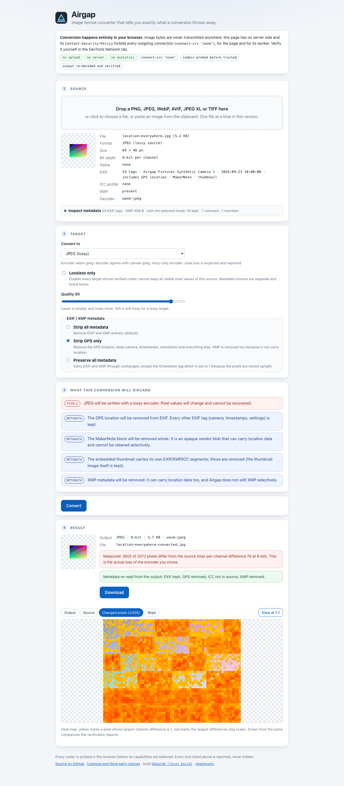

# Airgap

A static, fully client-side image format converter that tells you exactly what
a conversion throws away before you click Convert, measures what it actually
threw away afterwards, and shows you where.

**Conversion happens entirely in your browser. Image bytes are never
transmitted anywhere.** There is no server side, no upload, no analytics, no
telemetry, and no remote assets at runtime. (The machine running it is not
"air-gapped"; the name refers to the app's own behaviour: it never connects to
anything.)

Live: **https://satvikpraveen.github.io/airgap/**

Formats: PNG, JPEG, WebP, AVIF, JPEG XL and TIFF in; PNG, JPEG, WebP, AVIF,
JPEG XL and TIFF out. HEIC is deliberately absent (see below).

<p align="center">
  
</p>

## Why this exists

Most converters silently destroy data. Airgap:

- lists every loss **before** conversion in a warning panel, split into
  `pixels` (visible pixel values change, or cannot be shown not to) and
  `metadata` (EXIF, XMP, ICC, colour description dropped or altered);
- offers a **Lossless only** toggle that disables any target whose *verified*
  codec cannot keep all visible pixel values of *this* source;
- **refuses to composite RGBA onto black**: converting an image with alpha to
  JPEG requires you to pick a flatten colour (default white);
- lets you choose what happens to **EXIF/XMP** (strip all, strip GPS only,
  preserve all) and, separately, to the **ICC profile** (strip, preserve,
  convert to sRGB), and says for each what it does to appearance and to values;
- shows you the **metadata itself**: every EXIF tag with its value, and the XMP
  packet, each marked kept / removed / rewritten for the mode you selected, so
  nothing leaves the file without you having been able to look at it;
- reports **wide-gamut and HDR colour descriptions** (BT.2020, P3, PQ, HLG)
  that a container declares, instead of silently treating them as sRGB;
- **probes every codec in your browser before believing it**: a codec's
  declared capabilities are a hypothesis; a 24x24 test image with opaque noise,
  semi-transparent pixels and colour hidden under alpha 0 is encoded, decoded,
  compared exactly and, where possible, cross-checked with the browser's own
  decoder. Whatever cannot be demonstrated is reported as unavailable;
- **verifies after conversion** by decoding its own output, diffing every
  sample against what it encoded (transparent pixels included), re-reading the
  container to confirm which metadata is present, and drawing a **heat map of
  every pixel that changed** next to source / output / wipe views;
- writes PNG in the **smallest exact layout** (greyscale, palette, RGB or
  RGBA, 8 or 16-bit) and tells you which one it chose.

## Verify the privacy claim yourself

1. **DevTools.** Open the app, open the Network tab, load and convert an image.
   After the page and its worker have loaded, the only requests you can ever
   see are lazy loads of the app's own codec chunks (`/airgap/assets/*.js`),
   the first time a format is used. Nothing goes anywhere else, and no request
   carries image data.
2. **The CSP.** View the page source. The `Content-Security-Policy` meta tag
   contains `connect-src 'none'` and `default-src 'none'`: the browser itself
   refuses to let the page open any connection. Two details matter:
   - A meta-tag CSP applies to the document, and a dedicated worker started
     from a same-origin URL takes its policy from HTTP response headers that
     GitHub Pages does not send. Airgap therefore starts its worker from a
     `blob:` URL (`worker-src blob:`), and a blob worker inherits the page's
     policy. Verified in Chromium: inside the blob worker, `fetch()` of both
     cross-origin and same-origin URLs raises a `connect-src` violation and no
     request is made.
   - `script-src` includes `'wasm-unsafe-eval'`. This keyword lets the browser
     compile WebAssembly, which the image codecs are. It does **not** enable
     JavaScript `eval()` or `new Function()` (that would be `'unsafe-eval'`,
     which the policy does not contain and a test asserts it never will), and
     it opens no network path. Because `connect-src 'none'` forbids fetching a
     `.wasm` file even from our own origin, the wasm binaries are embedded as
     base64 inside lazily imported script chunks.
   - There is no service worker, by design. A worker that intercepts responses
     has no place in a privacy tool, even for offline caching. The app is
     installable through its web app manifest without one.
3. **The automated tests.** `npm run test:e2e` runs `tests/e2e/privacy.spec.ts`
   against the production build. After the app is ready and the codecs a
   conversion needs are loaded, it routes every request through a handler that
   records and aborts it, records every CSP violation, runs four conversions,
   and asserts both lists are empty. A `fetch()` blocked by CSP never becomes a
   request, which is why both channels are watched. A second test pins down
   lazy loading: while codecs load, every request must be a plain `GET` of a
   file that exists by exact name in `dist/assets`. Positive controls prove
   the trap catches a fetch, an image beacon, a WebSocket, and a fetch from
   inside a worker. The suite was verified to be able to fail: a temporary
   `fetch('https://example.invalid/leak-test')` in the app turned it red
   through the CSP channel, and with `connect-src` relaxed it turned red
   through the request channel.
4. **Read the source.** `src/` contains no `fetch`, `XMLHttpRequest`,
   `WebSocket`, `sendBeacon` or `importScripts` of its own. The bundled codec
   glue can reference its `.wasm` by URL, but it is always handed a compiled
   module instead and the raw `.wasm` files are stripped from the build.
5. **Verify what is deployed is what was built.** The footer names the commit
   the running build came from. Every build writes `checksums.txt` (SHA-256
   of every shipped file), and the deploy workflow signs it with GitHub build
   provenance. To check that the site serves exactly what the workflow built
   from that commit:

   ```sh
   curl -sO https://satvikpraveen.github.io/airgap/checksums.txt
   gh attestation verify checksums.txt --repo SatvikPraveen/airgap
   # then fetch any listed file from the site and compare:
   curl -s https://satvikpraveen.github.io/airgap/index.html | sha256sum
   grep index.html checksums.txt
   ```

## What is provably lossless (Chromium, measured by the test suites)

Exact means every sample of every pixel, R, G, B and A, including RGB stored
under alpha 0, compared with a plain `===` after decoding the output again.

| Round trip | Exact? | Evidence |
| --- | --- | --- |
| PNG 8-bit RGBA to PNG, WebP lossless, AVIF lossless, TIFF | **yes** | codec round trips, pipeline verification, downloaded bytes re-read by pngjs / image-js |
| PNG 16-bit RGBA to PNG, TIFF | **yes, at 16-bit** | pngjs and image-js read back identical Uint16 samples; Chromium's decoder confirms the byte order |
| PNG palette / greyscale / grey+alpha sources and outputs | **yes** | the writer's layouts decoded by pngjs (Node) and by both the Rust decoder and Chromium |
| AVIF 10-bit and 12-bit RGBA to AVIF lossless | **yes** | codec round trips |
| TIFF 8/16-bit (straight alpha) to PNG/WebP/AVIF/TIFF | **yes** | fixtures written by an independent writer, read by utif, verified by image-js |
| WebP lossless, AVIF lossless sources to any lossless target | **yes** | fixture decodes match the generating pattern exactly |
| JPEG XL, either direction | **no** | see below |
| Anything through the canvas fallback with transparency | **no** | canvas is premultiplied: semi-transparent RGB rounds, RGB under alpha 0 is zeroed |
| Any 16-bit source to WebP or JPEG XL | no, 8-bit output | flagged as `bit-depth` |
| TIFF with associated (premultiplied) alpha | no | un-premultiplying rounds; flagged as `associated-alpha` |

Round trips that are exact today are only ever *offered* as lossless after the
probe has demonstrated them in the running browser.

### The 16-bit PNG byte-order bug, and why an independent writer matters

Until Phase 4 every 16-bit PNG Airgap wrote was byte-swapped. The Rust
encoder copies the sample bytes it is given straight into the file, and the
app handed it native little-endian samples, so every other reader saw wrong
values. It went unnoticed because the whole 16-bit chain was consistently
swapped: the decode path byte-swapped what the Rust decoder returned (which
was already correct), the 16-bit fixtures had been generated by writing
big-endian into pngjs's native-endian buffer, and the e2e helper read pngjs's
native buffer as big-endian. Every test agreed with every other test, and all
of them were wrong. Writing an independent PNG encoder exposed the mismatch,
and Chromium's own decoder was the tie-breaker. The lesson is baked into the
test suite: 16-bit outputs are now checked by three decoders that share no
code.

### JPEG XL is decode and lossy-encode only

The `@jsquash/jxl` encoder/decoder pair (a libjxl snapshot from January 2022,
decoding through a float path) reproduces our alpha test image with a maximum
channel difference of 1 on a handful of pixels, opaque ones included. That is
not exact, so the probe refuses to mark it lossless and the "JPEG XL
(lossless)" target is disabled with the reason shown. There is no independent
JPEG XL decoder in the browser to attribute the error to one side, so
JPEG XL *sources* also carry a `decoder-unverified` pixel loss: the output
cannot be called lossless. If a future package fixes this, the probe will
notice and the tests in `tests/browser/wasm-codecs.test.ts` that assert the
current behaviour will fail, which is the intended signal.

### RGB under alpha 0 is a pixel loss

Fully transparent pixels still carry RGB. Sprite sheets and game textures put
deliberate colour bleed under alpha-0 borders so that bilinear filtering does
not pull fringing into visible edges; flattening those to `0,0,0,0` destroys
real information even though no viewer shows it. Any pipeline that cannot keep
it (the canvas fallback) is excluded by lossless-only, and the tests assert
exact equality over the full RGBA tuple without skipping alpha-0 regions.

## PNG output layout

PNG output goes through Airgap's own writer (`src/codecs/png-writer.ts`).
It analyses the pixels once and stores them in the smallest colour type that
keeps every sample exactly:

| Pixels | Layout written |
| --- | --- |
| up to 256 distinct RGBA colours (8-bit) and smaller than the direct form | palette, 1/2/4/8-bit index, `tRNS` only if any entry is not opaque |
| R = G = B everywhere | greyscale (with alpha if any pixel is not opaque) |
| otherwise | RGB, or RGBA if any pixel is not opaque |
| 16-bit sources | the same choices at 16 bits (no palette) |

A fully opaque alpha channel is dropped; the decoded RGBA tuple is identical.
Rows are filtered adaptively (minimum sum of absolute differences) and
deflated with pako. The result panel says which layout was written ("Stored
as: palette (43 colours), 8-bit"), and PNG sources show theirs. The Rust
encoder (always RGBA) remains registered as the fallback should the writer's
probe ever fail, and canvas after that.

## Metadata and colour

**EXIF / XMP**, defaulting to strip all:

- *Strip all*: EXIF and XMP removed.
- *Strip GPS only*: removes every place inside the file's metadata where a
  location can live, and keeps the rest. See "What strip GPS only guarantees"
  below for the exact contract.
- *Preserve all*: EXIF and XMP carried through byte-for-byte, with **one
  exception that the loss panel states**: Airgap stores pixels upright, so a
  carried EXIF Orientation tag is rewritten to 1. Carrying the original tag
  would make viewers rotate the already-rotated image again. Tested with an
  Orientation=6 fixture.

**Inspect metadata** (under the source panel) lists every tag in IFD0, Exif,
GPS, Interop and IFD1 with its name, type and value, plus the XMP packet as
text, and marks each row for the selected mode and target: kept, removed, or
rewritten. The rules are the same ones the pipeline applies, so what the table
says is what the output will contain.

**ICC profile**, defaulting to strip:

- *Strip*: pixel values preserved, appearance not (viewers assume sRGB).
- *Preserve*: values and appearance preserved, if the target can embed a
  profile.
- *Convert to sRGB*: appearance preserved, values changed, profile dropped.
  Only matrix/TRC profiles (sRGB, Display P3, Adobe RGB, ProPhoto and the
  like) are converted. On a LUT-based profile the option is **disabled with
  the reason shown**; Airgap never approximates a LUT with the matrix path.

**Colour descriptions (CICP).** AVIF (`colr`/nclx), PNG (`cICP`) and JPEG XL
(the codestream's colour encoding) can declare primaries and a transfer
function without an ICC profile. Airgap reads them and, when they are not
sRGB-like (BT.2020 or P3 primaries; PQ or HLG transfer, which mean HDR),
lists a loss: through a decoder that keeps values (libavif) it is a
metadata-severity loss saying the pixel values are preserved but no encoder in
use writes the description, so viewers will show the image as sRGB (and an
HDR image will look dark and desaturated); through a decoder that converts to
sRGB itself (libjxl) it is a pixel loss. The source panel shows the
description and an HDR badge.

### What "strip GPS only" guarantees, and what it does not

It removes, from the metadata Airgap carries into the output:

1. the EXIF **GPS IFD** (and its pointer, in IFD0 and IFD1);
2. the EXIF **MakerNote** (tag 0x927c), dropped whole. It is an opaque vendor
   blob that routinely contains location and cannot be cleaned selectively;
   the loss panel says so when one is present;
3. any EXIF, XMP or ICC segments inside the **embedded thumbnail** JPEG (the
   thumbnail picture itself is kept). If the thumbnail cannot be rewritten it
   is dropped;
4. **XMP** entirely, because XMP can carry `exif:GPS*` and free-text fields
   and Airgap does not edit XMP selectively.

Every other EXIF tag (camera make and model, timestamps, exposure settings,
resolution, the Exif and Interop sub-IFDs, the Orientation tag normalised to
1) is carried unchanged. The ICC profile follows the separate ICC choice.

This is verified on real outputs, not on parsed tags: the fixture
`location-everywhere.jpg` hides one coordinate in the GPS IFD, in a MakerNote,
in XMP and in the thumbnail's own EXIF; after strip-GPS-only into JPEG, PNG,
WebP, TIFF, AVIF and JPEG XL, a raw byte scan for the coordinate values (as
decimal text, as XMP text, and as EXIF rationals in both byte orders) finds
nothing, while "preserve" into the same containers demonstrably puts them
back (`tests/browser/strip-gps.test.ts`, `tests/e2e/metadata.spec.ts`).

It does **not** guarantee:

- that a location typed into a free-text EXIF field survives removal: fields
  such as `ImageDescription`, `UserComment`, `Artist` or `Copyright` are kept
  as-is, because they are not location fields and Airgap does not guess at
  their contents (the inspector shows you their values so you can decide);
- anything about the pixels: a photo of a street sign is still a photo of a
  street sign, and steganographic or watermarked location data is untouched;
- anything about metadata Airgap never carries in the first place (PNG `tEXt`
  chunks, JPEG comment segments, proprietary APP segments): those are dropped
  in every mode, which is why they cannot leak, but "strip GPS only" is not
  what removes them.

If you need certainty, use "strip all".

Which targets can carry what: PNG, JPEG, WebP and TIFF carry EXIF, ICC and
XMP (verified by the probe: what goes in must come back out). AVIF and
JPEG XL cannot carry any of them through the codecs in use; choosing
"preserve" for those targets lists the loss and the post-conversion check
reports "removed".

The JPEG XL decoder applies the embedded ICC profile itself (to sRGB) and
cannot be told not to; that conversion is reported as a pixel loss for JXL
sources with a profile.

## After conversion: verification and the compare view

The output is decoded again and every sample is compared with what was
encoded. The result panel states the outcome ("every pixel matches exactly at
16-bit", or "2,605 of 3,072 pixels differ, max per-channel difference 76") and
re-reads the container header to confirm which metadata is present. Below it,
the compare view offers **Output**, **Source**, **Changed pixels** and
**Wipe** tabs with fit / 1:1 zoom. The changed-pixels view is a heat map drawn
from the same comparison (log scale: yellow marks a difference of 1, red the
largest); it is disabled, and says so, when the output is identical.

## Limits and recovery

- **Cancel** is available while decoding or converting. A WebAssembly codec
  cannot be interrupted, so cancel terminates the worker, starts a fresh one,
  reloads the current source and re-verifies codecs on demand. A worker crash
  takes the same path and says so.
- **Memory guard.** From the header alone, before decoding: above 80
  megapixels the file is refused with the dimensions and the reason (the
  pipeline holds decoded RGBA up to three times over, and a tab that runs out
  of memory dies without a message); above 24 MP a notice estimates the peak.
- **Input.** Drop, pick, or paste from the clipboard. Installed as a web app,
  Airgap registers as a handler for the six image types, so the OS can open a
  file with it; the file arrives in memory exactly like a drop.

## HEIC

Left out. `libheif-js` can decode HEIC without cross-origin isolation, but
the package ships no LICENSE file, so its LGPL-3 obligations cannot be met
against absent terms, and HEVC decoding is patent-pool licensed. The decision
and the evidence are in `docs/phase3-codec-survey.md`. It may return later as
an explicit opt-in module.

## Codec selection

Every format has an ordered list of codecs; the first whose probe demonstrates
the needed role wins, and the browser canvas is always registered last as the
fallback (declaring `exactAlpha: false`, 8-bit, no EXIF orientation of its
own). Selection and the loss computation read probed capability fields only;
no codec is ever special-cased by name. If the preferred decoder rejects a
particular file (mozjpeg refuses CMYK JPEGs, libwebp refuses animations), the
next decoder is tried for that file and the source panel names the one used.

| Format | Preferred codec | Fallbacks |
| --- | --- | --- |
| PNG | `airgap-png`: Rust `png` crate decode (8/16-bit) + Airgap's layout-minimising writer | `wasm-png` (Rust encoder, always RGBA), then canvas |
| JPEG | @jsquash/jpeg (mozjpeg) | canvas |
| WebP | @jsquash/webp (libwebp, `exact: 1`) | canvas |
| AVIF | @jsquash/avif (libavif + aom), 8/10/12-bit | canvas (decode only) |
| JPEG XL | @jsquash/jxl (libjxl snapshot), 8-bit | none |
| TIFF | utif (decode) + own baseline writer, 8/16-bit | none |

The TIFF writer is uncompressed baseline, little-endian, single strip, straight
alpha declared as `ExtraSamples=2`, and is validated against two independent
readers (utif and image-js `tiff`), never only against its matching reader.
Fixture TIFFs come from a third, independent writer in the fixture script.

Known limitation: AVIF `irot`/`imir` rotation properties are detected and
reported as a pixel loss but not applied by the decoder in use.

## Bundle size

Measured with `node scripts/bundle-report.mjs` after `npm run build`
(gzip -9). `npm run check:budget` fails CI if any group exceeds its ceiling.

| Payload | gzipped |
| --- | --- |
| First paint (HTML + CSS + main JS, includes the inline bootstrap worker, inspector and compare view) | 22 KB |
| Worker module (registry, pipeline, metadata layer, PNG and TIFF writers, pako) | 32 KB |
| PNG decoder (lazy) | 108 KB |
| JPEG codec (lazy) | 177 KB |
| WebP codec (lazy) | 228 KB |
| TIFF (lazy, pure JS) | 28 KB |
| JPEG XL codec (lazy) | 1.13 MB |
| AVIF codec (lazy) | 1.95 MB |

A user converting a single JPEG downloads the first two rows plus the codecs
for JPEG and the chosen target. Base64 embedding costs about 1.3x on the
gzipped wasm compared with a raw `.wasm` file; that is the price of keeping
`connect-src 'none'`.

## Development

Node 20+ and npm.

```sh
npm install
npx playwright install chromium   # once; needed by the browser + e2e tests
npm run dev            # local dev server (relaxes ONLY connect-src/style-src/worker-src for HMR)
npm run build          # notices check + typecheck + production build to dist/ (base /airgap/) + checksums.txt
npm run preview        # serve dist/ at http://localhost:4173/airgap/
npm test               # Vitest: node unit tests + real-codec tests in headless Chromium
npm run test:e2e       # Playwright against the production build
npm run check:notices  # third-party notices complete and consistent
npm run check:budget   # gzip size ceilings per chunk group (needs dist/)
npm run fixtures       # regenerate tests/fixtures/ deterministically
node scripts/bundle-report.mjs
node scripts/make-icons.mjs                       # regenerate public/icon-*.png
node scripts/screenshots.mjs docs/screenshots     # light/dark/phone screenshots (preview must be running)
```

### Layout

```
src/codecs/types.ts        Codec interface, PixelData (8/10/12/16-bit RGBA), capabilities, colour description
src/codecs/probe.ts        runtime capability probe (pure: codec API only)
src/codecs/registry.ts     per-format ordered codecs, lazy loading, per-file fallback
src/codecs/canvas.ts       browser canvas fallback (exactAlpha: false)
src/codecs/png-writer.ts   own PNG writer: minimal exact colour type, adaptive filters
src/codecs/wasm/*.ts       @jsquash-backed PNG (decode), JPEG, WebP, AVIF, JPEG XL
src/codecs/tiff.ts         utif decode + own baseline writer
src/inspect.ts             pure header parsing for all six formats, incl. CICP colour descriptions
src/capabilities.ts        pure: source + target + probed pipeline -> list of losses
src/convert.ts             pure orchestration: ICC, bit depth, flatten, metadata, verification, diff mask
src/limits.ts              memory guard thresholds and messages
src/metadata/tiff-ifd.ts   generic TIFF IFD parser/serializer
src/metadata/exif.ts       EXIF summarise, strip GPS, normalise orientation
src/metadata/exif-list.ts  every tag as a row, and what each mode does to it
src/metadata/containers.ts EXIF/ICC/XMP in and out of JPEG, PNG, WebP containers
src/metadata/icc.ts        ICC parse, matrix/LUT classification, matrix/TRC -> sRGB
src/worker-boot.ts         inline blob: bootstrap so the worker inherits the CSP
src/worker.ts              conversion worker
src/ui/                    drop zone, source facts, metadata inspector, target picker, modes,
                           loss panel, result, compare view, cancel/recovery (workerClient)
scripts/                   fixtures, icons, screenshots, bundle report, budget, notices, checksums
tests/unit/                Vitest, node: matrix, metadata layer, ICC, PNG writer vs pngjs, TIFF writer vs two readers
tests/browser/             Vitest browser mode: real codecs, probes, full pipeline, exifr
tests/e2e/                 Playwright: downloads re-read independently, privacy trap, inspector, compare, recovery
tests/fixtures/            generated by scripts/make-fixtures.mjs
licenses/                  verbatim licence texts of everything bundled (see THIRD_PARTY_NOTICES.md)
docs/                      codec survey, screenshots
```

## Deploy

Static files in `dist/`, built with Vite `base: '/airgap/'` for GitHub Pages at
`https://<user>.github.io/airgap/`. Every URL the page emits is derived from
that base, so nothing in the build assumes a root path.

Two GitHub Actions workflows:

- `.github/workflows/ci.yml` runs on every pull request: notices check,
  typecheck, unit, browser and e2e suites, a production build and the bundle
  budget. Playwright's Chromium is cached keyed on the exact Playwright
  version in the lockfile.
- `.github/workflows/deploy.yml` runs on push to `main`: it calls the same
  test workflow, and only if that job succeeds does the deploy job build
  `dist/` (with the commit hash injected into the footer), check the budget,
  **attest `checksums.txt` with build provenance**, and publish with
  `actions/deploy-pages`. In the repository settings, Pages must be set to
  "GitHub Actions" as the source.

## Licence

Airgap is released under the [MIT licence](LICENSE). The codecs it bundles are
separate works under their own terms: Apache-2.0 (jSquash wrappers, Highway),
BSD (mozjpeg/libjpeg-turbo, libwebp, libavif, libaom, libjxl, skcms), MIT
(Brotli, UTIF.js, pako, Emscripten, the Rust `png` crate and wasm-bindgen)
and the Alliance for Open Media Patent License 1.0 for AV1. Every component,
its role, and the verbatim licence text are listed in
[THIRD_PARTY_NOTICES.md](THIRD_PARTY_NOTICES.md) and the `licenses/`
directory, and published with the app at `licenses.html`. `npm run
check:notices` fails the build if a bundled dependency goes unlisted.

This software is based in part on the work of the Independent JPEG Group.
